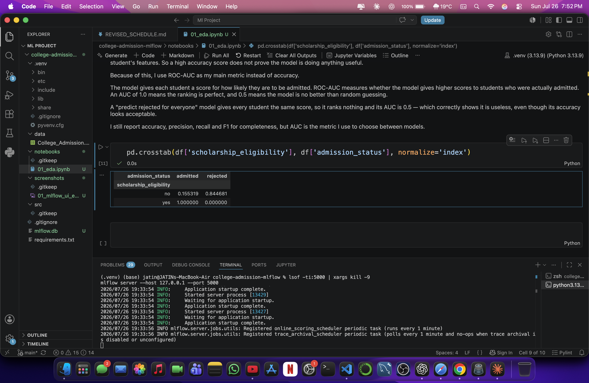
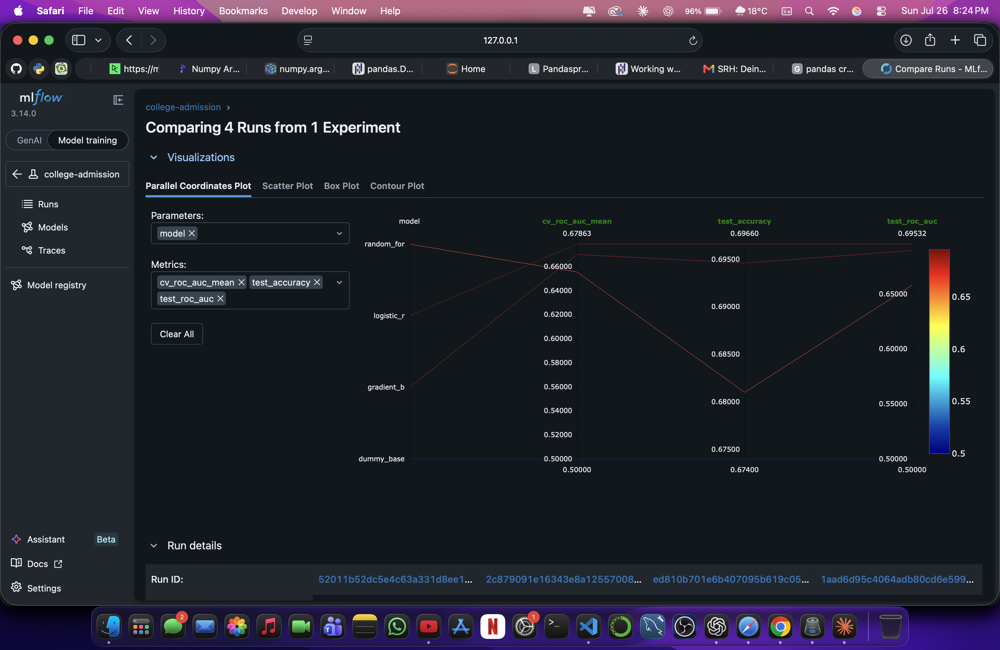
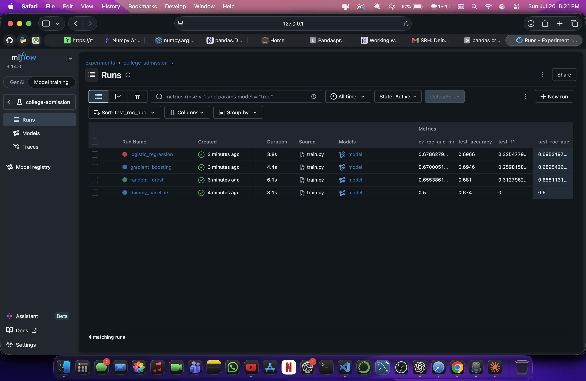
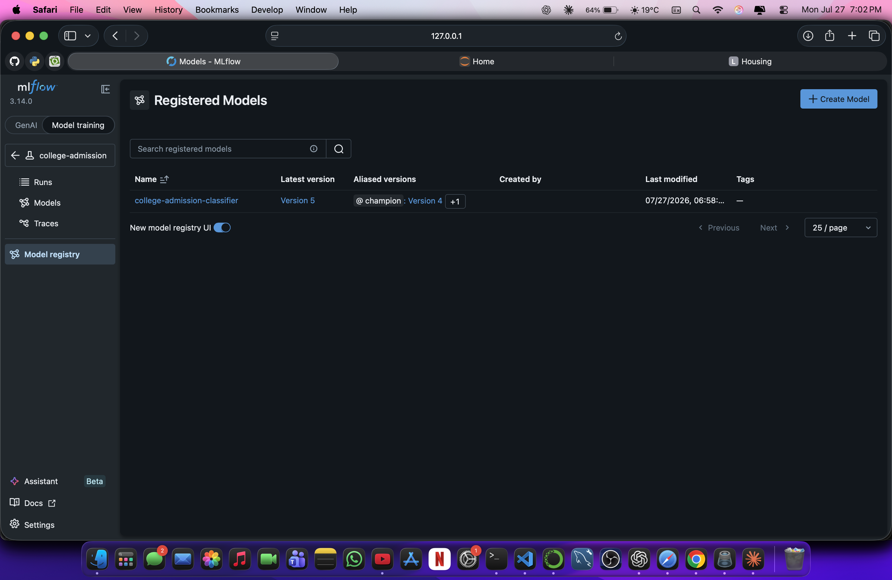
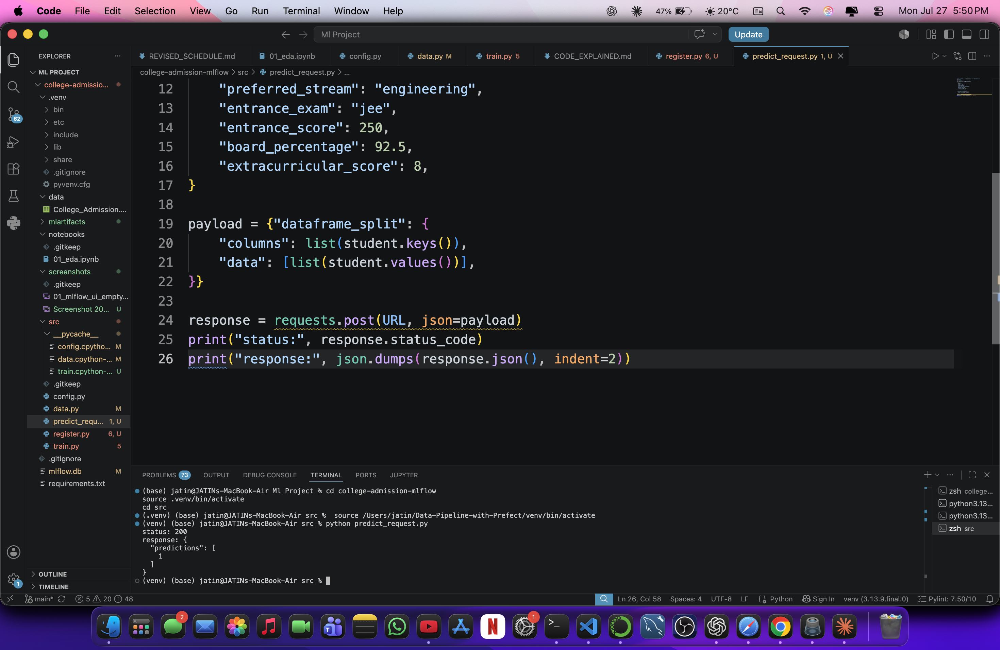
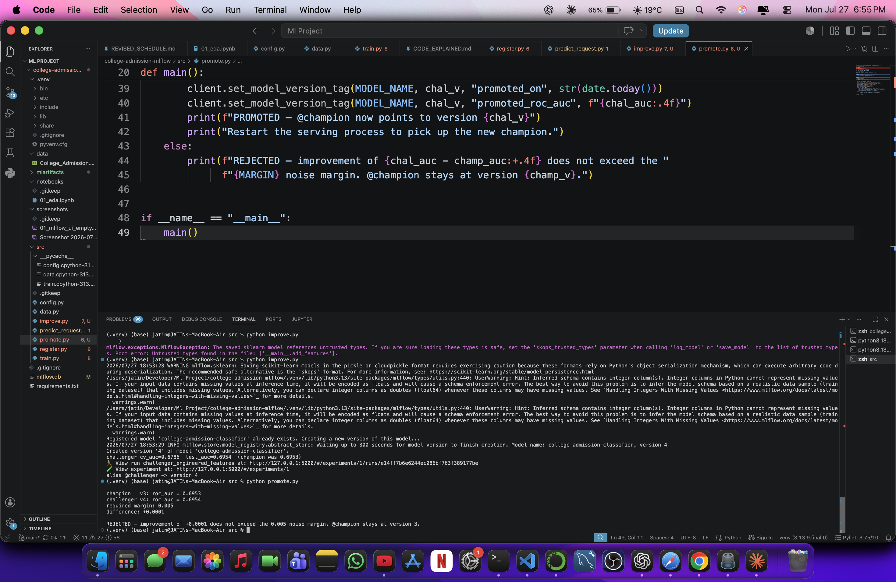
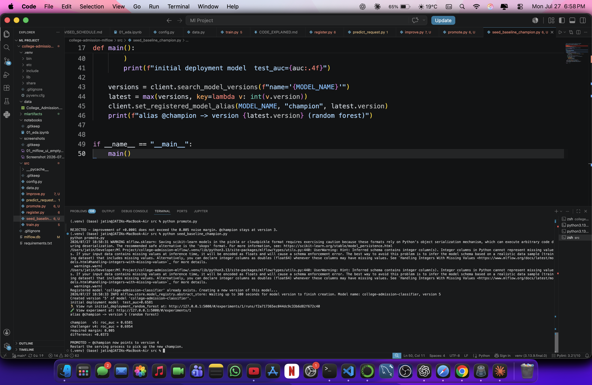

# College Admission Prediction — End-to-End ML Lifecycle with MLflow

Predicting university admission outcomes from applicant data, built as a full production-shaped ML lifecycle: experiment tracking, model registry, served inference endpoint, and automated champion/challenger promotion.

**Stack:** Python 3.13 · scikit-learn · MLflow 3.14 · pandas

---

## Table of contents

1. [Problem statement](#problem-statement)
2. [Dataset](#dataset)
3. [Data leakage analysis](#data-leakage-analysis) ⭐
4. [Performance ceiling](#performance-ceiling)
5. [Methodology](#methodology)
6. [Results](#results)
7. [Why this model is considered good](#why-this-model-is-considered-good)
8. [Model selection rationale](#model-selection-rationale)
9. [MLflow lifecycle](#mlflow-lifecycle)
10. [Project structure](#project-structure)
11. [Reproducing this project](#reproducing-this-project)
12. [Limitations and next steps](#limitations-and-next-steps)

---

## Problem statement

Given an applicant's demographics, academic record, and entrance exam performance, predict whether they will be admitted.

This is binary classification on imbalanced tabular data. The practical use case is **ranking applicants by admission likelihood** rather than issuing hard accept/reject decisions, which is why the model is evaluated primarily on ranking quality (ROC-AUC) rather than accuracy.

---

## Dataset

`College_Admission.csv` — 25,000 rows, 13 columns, no missing values.

| Column | Type | Notes |
|---|---|---|
| `student_id` | float | Identifier — dropped |
| `age` | int | 17–20 |
| `gender` | categorical | male / female / other |
| `category` | categorical | general / obc / sc / st / ews |
| `state` | categorical | 26 values |
| `preferred_stream` | categorical | 12 values |
| `entrance_exam` | categorical | cet / jee / neet / none |
| `entrance_score` | int | 0–634, scale varies by exam |
| `board_percentage` | float | ~40–100 |
| `extracurricular_score` | int | 0–10 |
| `admission_probability` | float | ⚠️ Leakage — dropped |
| `admission_status` | categorical | 🎯 **Target** |
| `scholarship_eligibility` | categorical | ⚠️ Leakage — dropped |

**Class balance:** 67.4% rejected, 32.6% admitted.

---

## Data leakage analysis

**This was the most important finding in the project.** Two columns encode the answer and were removed before any modelling.

### `scholarship_eligibility`



| scholarship_eligibility | admitted | rejected |
|---|---|---|
| no | 0.155 | 0.845 |
| **yes** | **1.000** | **0.000** |

Every student marked "yes" was admitted — 100%, with no exceptions across 25,000 rows.

This is not a predictive signal; it is the answer stored in a different column. A college decides to admit a student first, and only then determines scholarship eligibility. For a real applicant whose decision has not yet been made, this field would be empty. Training on it would teach the model a single rule — "yes means admitted" — that cannot be applied at prediction time.

### `admission_probability`

| admission_status | mean | min | max |
|---|---|---|---|
| admitted | 0.387 | 0.042 | 0.731 |
| rejected | 0.294 | 0.042 | 0.731 |

This is the score used to generate the label, so it would not exist for a real applicant either. It is a weaker giveaway than the scholarship column — the two distributions overlap heavily — but it is leakage nonetheless.

### Columns dropped

| Column | Reason |
|---|---|
| `scholarship_eligibility` | Target leakage — determined after admission |
| `admission_probability` | Target leakage — the label's generating score |
| `student_id` | Identifier with no predictive meaning |

**Impact:** retaining these columns produces near-perfect accuracy that would collapse entirely in production. Removing them brings measured performance down to roughly 70% — which is the honest number.

---

## Performance ceiling

Before training, I established the maximum achievable performance on this dataset by using `admission_probability` directly as a prediction:

```python
roc_auc_score(y, df['admission_probability'])   # 0.6847
```

Since this is the column the label was generated from, **0.685 ROC-AUC is approximately the theoretical ceiling** for any model here.

It is far below 1.0 because `admission_probability` does not determine the outcome — it sets the odds. A student with probability 0.6 had a 60% chance of admission, not a guarantee. Two students with identical features can therefore receive different outcomes, meaning part of the label is irreducibly random and no model can predict it.

This reframes the entire results section: the target is not "as close to 100% as possible" but "as close to 0.685 as possible."

---

## Methodology

**Split.** 80/20 stratified train/test split (`random_state=42`). Stratification preserves the 67/33 class balance in both halves, so the test set measures the same problem the model was trained on.

**Preprocessing.** Wrapped in a scikit-learn `Pipeline` with a `ColumnTransformer`:
- Categorical features → `OneHotEncoder(handle_unknown="ignore")`
- Numeric features → `StandardScaler`

Using a Pipeline is deliberate. It ensures preprocessing is fitted only on training folds during cross-validation (preventing subtle leakage from the held-out fold), and it packages preprocessing and model into a single deployable artifact that accepts raw applicant data.

**Model selection.** 5-fold cross-validation on ROC-AUC, computed on the training set only. The test set was evaluated once, after the model was chosen.

**Primary metric: ROC-AUC.** Accuracy is unusable here — a model predicting "rejected" for every applicant achieves 67.4% accuracy while being completely useless. ROC-AUC measures how well the model ranks admitted applicants above rejected ones, independent of class balance and independent of any decision threshold.

---

## Results

All runs tracked in MLflow.



| Model | CV ROC-AUC | Test ROC-AUC | Accuracy | F1 |
|---|---|---|---|---|
| Dummy (majority class) | 0.5000 | 0.5000 | 0.6740 | 0.0000 |
| **Logistic regression** | **0.6786** | **0.6953** | 0.6966 | 0.3255 |
| Gradient boosting | 0.6700 | 0.6895 | 0.6946 | 0.2598 |
| Random forest | 0.6554 | 0.6581 | 0.6810 | 0.3128 |
| *Theoretical ceiling* | — | *0.6847* | — | — |

**The dummy classifier row is the clearest argument for the metric choice:** it achieves 67.4% accuracy while scoring exactly 0.5 AUC and 0.0 F1. Accuracy alone would make a model that does nothing look acceptable.

### Logistic regression won

The simplest model beat both ensembles, on cross-validation *and* on the test set — so this is consistent, not a lucky split.

This is explainable from how the data was generated. If `admission_probability` was constructed as a broadly additive function of the features, the true relationship is close to linear, which is exactly what logistic regression assumes. Gradient boosting and random forest have the capacity to model complex feature interactions, but there are none here, so that capacity fits noise instead. Random forest — the most flexible model — scored worst, which is consistent with that explanation.

### Hyperparameter tuning

`RandomizedSearchCV` over 15 configurations (regularisation strength `C` from 0.001 to 100, and class weighting) improved cross-validated AUC from 0.6786 to 0.6810 — a gain of **+0.0024**, which falls below the 0.005 noise margin used by the promotion gate. Test AUC moved from 0.6953 to 0.6959.

The search selected `C = 0.001`, the strongest regularisation in the range, indicating the model performs best when heavily constrained. This is consistent with the earlier finding that the underlying relationship is close to linear, and with the conclusion that the model had already reached the dataset's measured ceiling of ~0.685.

---

## Why this model is considered good

1. **It beats the naive baseline meaningfully** — 0.6953 vs 0.5000 AUC.
2. **It is at the theoretical ceiling** — 0.6953 against a measured maximum of ~0.685. The remaining error is irreducible label noise, not model weakness.
3. **It generalises consistently** — cross-validation (0.6786) and test (0.6953) are close, indicating no overfitting.
4. **It uses no leaked features** — every input is available at genuine prediction time.
5. **It fits the actual use case** — the model outputs ranked probabilities rather than hard decisions, which is what an admissions process needs for prioritising applicants. (Calibration itself has not been verified — see Next steps.)

A higher number was available by retaining the leaked columns. It would have been meaningless.

---

## Model selection rationale

Four model families were evaluated, spanning a deliberate range: a naive floor, a linear model, a bagging ensemble, and a boosting ensemble.

**Models not used, and why:**

| Model | Reason for exclusion |
|---|---|
| **SVM** | Kernel SVM scales between O(n²) and O(n³); at 25,000 rows with one-hot expansion this is prohibitively slow inside cross-validation. It also lacks native probability output — `probability=True` requires internal Platt scaling — which conflicts with an AUC-based evaluation. |
| **k-Nearest Neighbours** | Distance metrics degrade in high-dimensional one-hot space, and prediction cost scales with training set size, making it a poor fit for a served endpoint. |
| **Naive Bayes** | Assumes conditional independence between features, which is unlikely to hold, and is generally outperformed by logistic regression on this class of problem. |
| **Neural networks** | Substantially more data and tuning are needed to beat gradient boosting on tabular problems of this size; given the measured ceiling of 0.685, there was no headroom to justify the cost. |
| **XGBoost / LightGBM** | `HistGradientBoostingClassifier` uses the same histogram-based algorithm and is already in scikit-learn. Since boosting lost to a linear model here, a different boosting implementation was unlikely to change the conclusion. |
| **Stacking / voting ensembles** | Ensembling models that all sit at the same ceiling adds complexity and inference latency for no expected gain. |

---

## MLflow lifecycle

### 1. Tracking

Every run logs parameters, five metrics, a confusion matrix artifact, and the full serialised pipeline.



### 2. Model Registry

The champion is registered as a named, versioned model with an alias.



*The registry after promotion: `@champion` points at version 4.*

**Experiment vs Registry:** the experiment is the lab notebook — every run, including failures. The registry is the shelf of approved, deployable models.

### 3. Serving

```bash
mlflow models serve -m "models:/college-admission-classifier@champion" -p 5001 --env-manager local
```



The endpoint accepts raw applicant data because preprocessing is contained inside the served pipeline. Note the URI references the **alias**, not a version number — this is what makes automatic replacement possible.

### 4. Automated promotion

`src/promote.py` loads both champion and challenger, scores them on held-out data, and moves the `@champion` alias **only if** the challenger wins by more than a noise margin.

```python
MARGIN = 0.005   # required improvement; anything smaller is noise
```

Both outcomes were demonstrated.

**Rejection** — challenger with engineered features (`has_entrance_exam`, `entrance_score_norm`) scored 0.6954 against the logistic regression champion's 0.6953:

```
champion   v3: roc_auc = 0.6953
challenger v4: roc_auc = 0.6954
required margin: 0.005
difference: +0.0001

REJECTED — improvement of +0.0001 does not exceed the 0.005 noise margin.
```



The gate works: a +0.0001 difference is sampling noise, not a real improvement, and promoting it would be false progress. This is also further evidence of the ceiling — feature engineering could not extract gains that do not exist.

**Promotion** — to demonstrate the replacement path end to end, the champion alias was set to the earlier random forest model, representing an initial production deployment:

```
champion   v5: roc_auc = 0.6581
challenger v4: roc_auc = 0.6954
required margin: 0.005
difference: +0.0373

PROMOTED — @champion now points to version 4
```



Restarting the serving process with the **identical command** now serves version 4, because the alias moved. No code change, no redeployment configuration — the indirection layer does the work.

---

## Project structure

```
college-admission-mlflow/
├── data/
│   └── College_Admission.csv
├── notebooks/
│   └── 01_eda.ipynb              # EDA, leakage analysis, ceiling calculation
├── src/
│   ├── config.py                 # All settings in one place
│   ├── data.py                   # Loading and stratified splitting
│   ├── train.py                  # Pipeline construction, 4-model comparison
│   ├── tune.py                   # Hyperparameter search (RandomizedSearchCV)
│   ├── register.py               # Register champion, set @champion alias
│   ├── improve.py                # Challenger with engineered features
│   ├── promote.py                # Gated automatic promotion
│   ├── seed_baseline_champion.py # Sets up the promotion demo
│   └── predict_request.py        # Client for the served endpoint
├── screenshots/
├── requirements.txt
└── README.md
```

---

## Reproducing this project

```bash
git clone https://github.com/Jatin15012/college-admission-mlflow.git
cd college-admission-mlflow

python -m venv .venv
source .venv/bin/activate          # Windows: .venv\Scripts\activate
pip install -r requirements.txt

# Terminal 1 — tracking server
mlflow server --host 127.0.0.1 --port 5000

# Terminal 2 — train and register
cd src
python train.py                    # compare four models
python tune.py                     # hyperparameter search
python register.py                 # register champion, set alias

# Terminal 3 — serve
export MLFLOW_TRACKING_URI=http://127.0.0.1:5000
mlflow models serve -m "models:/college-admission-classifier@champion" -p 5001 --env-manager local

# Terminal 2 — predict, improve, promote
python predict_request.py
python improve.py                  # train challenger
python promote.py                  # gated promotion decision
```

MLflow UI: http://127.0.0.1:5000

---

## Limitations and next steps

**Limitations**

- The dataset is synthetic, with a stochastically generated label. Conclusions about which features matter do not transfer to real admissions data.
- The tracking server runs locally with a SQLite backend — appropriate for this scale, not for a team.
- No temporal validation. Real admissions data would need time-based splits, since admission criteria drift year to year.
- The model has not been audited for fairness across `category`, `gender`, or `state`, which is a serious gap for any real deployment.

**Next steps, in priority order**

1. **Fairness audit** — measure error rates across demographic subgroups before this could responsibly be used.
2. **Probability calibration** — verify predicted probabilities match observed frequencies, which matters for a ranking use case.
3. **SHAP explainability** — per-applicant explanations, likely a legal requirement in an admissions context.
4. **Threshold optimisation** — the 0.5 cutoff is arbitrary; the operating point should be chosen from the precision/recall tradeoff the institution actually wants.
5. **Drift monitoring** — detect when incoming applicant distributions diverge from training data.
6. **CI/CD** — automate train → evaluate → promote on a schedule.
7. **Containerisation and cloud deployment** — Docker plus a managed tracking server.

These were identified during the project and scoped out deliberately given the timeline, in favour of completing the full lifecycle.
